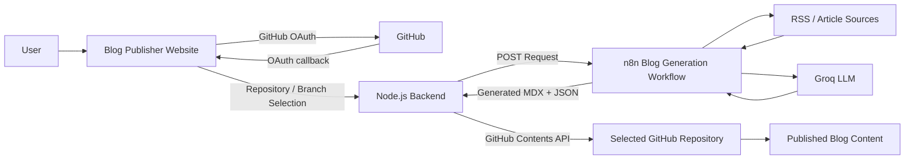
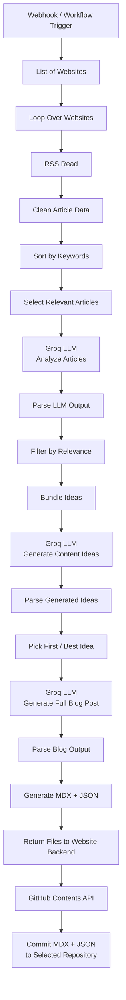
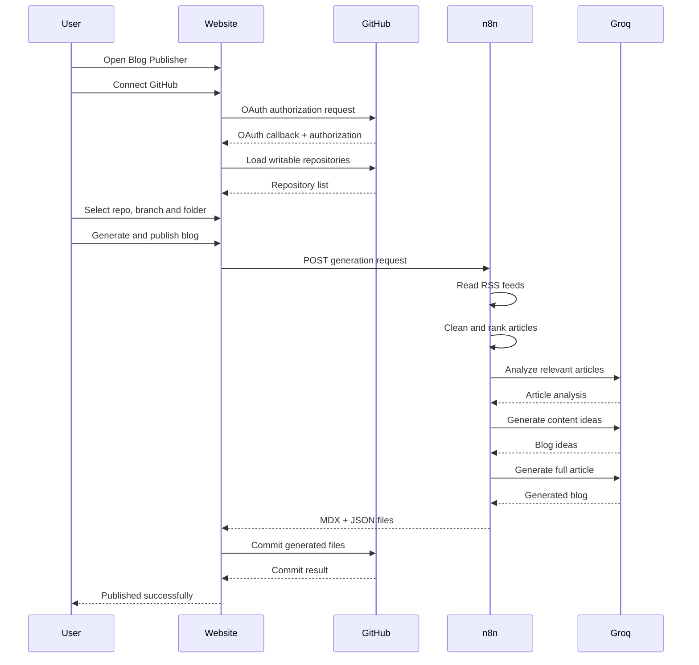

# n8n GitHub Blog Publisher

This project provides a website where a user can:

1. Connect their GitHub account through OAuth.
2. Select a writable repository.
3. Choose a branch and destination folder.
4. Trigger the n8n blog-generation workflow.
5. Publish the returned `.mdx` and `.json` files to the selected repository.

The GitHub access token is stored only in the server session. It is not placed in frontend JavaScript and is not sent to n8n.

## Architecture



## Blog Generation Workflow

The n8n workflow collects articles, ranks them by relevance, generates content ideas, creates a complete article, and returns the resulting MDX and JSON files to the application backend.



## End-to-End Publishing Flow



## Project structure

```text
n8n-github-blog-app/
├── public/
│   ├── app.js
│   ├── index.html
│   └── style.css
├── .env.example
├── .gitignore
├── n8n-workflow-website-version.json
├── original-workflow.json
├── package.json
├── README.md
└── server.js
```
